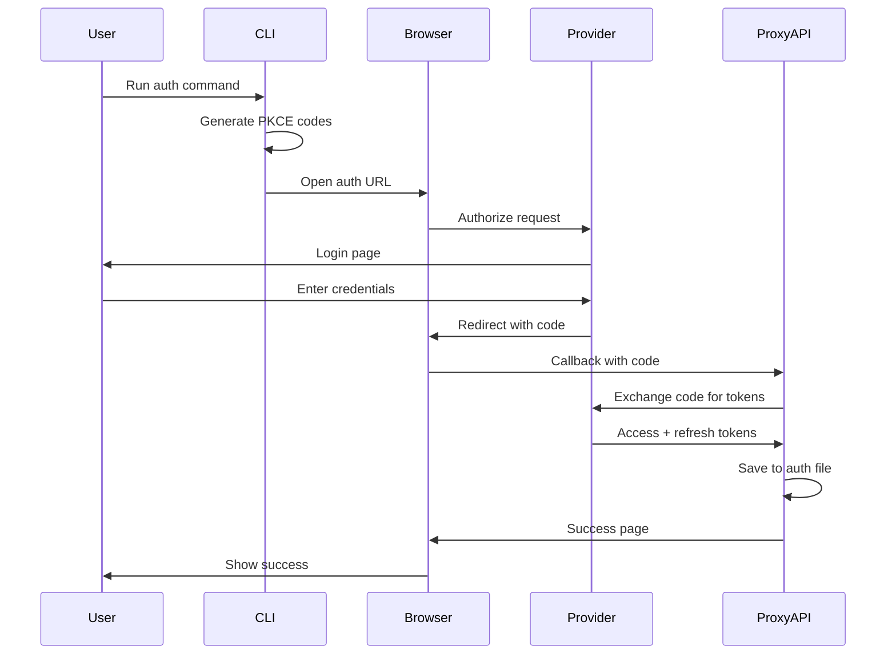

## Authentication Overview

CLI Proxy API supports multiple authentication methods to access AI providers:

1. **OAuth 2.0** - Use your existing subscriptions (Gemini, Claude, Codex, etc.)
2. **API Keys** - Traditional API key authentication (Gemini, Claude, OpenAI-compatible)
3. **Service Accounts** - Google Cloud service accounts (Vertex AI)

## Client Authentication

Clients authenticate to CLI Proxy API using API keys configured in `config.yaml`:

```yaml config.yaml
api-keys:
  - "sk-your-api-key-1"
  - "sk-your-api-key-2"
  - "sk-your-api-key-3"
```

Clients include the API key in the `Authorization` header:

```bash
curl http://localhost:8317/v1/chat/completions \
  -H "Authorization: Bearer sk-your-api-key-1" \
  -H "Content-Type: application/json" \
  -d '{
    "model": "gemini-2.5-pro",
    "messages": [{"role": "user", "content": "Hello"}]
  }'
```

## OAuth Authentication

OAuth providers require interactive authentication through a web browser.

### OAuth Flow



### PKCE (Proof Key for Code Exchange)

CLI Proxy API uses PKCE for enhanced OAuth security:

<CodeGroup>
```go internal/auth/claude/pkce.go
// PKCECodes contains the code verifier and challenge for PKCE flow
type PKCECodes struct {
    CodeVerifier  string
    CodeChallenge string
}

// GeneratePKCECodes creates a new PKCE code verifier and challenge
func GeneratePKCECodes() (*PKCECodes, error) {
    // Generate random 32-byte code verifier
    verifier := make([]byte, 32)
    if _, err := rand.Read(verifier); err != nil {
        return nil, err
    }
    codeVerifier := base64.RawURLEncoding.EncodeToString(verifier)
    
    // Create SHA256 challenge
    hash := sha256.Sum256([]byte(codeVerifier))
    codeChallenge := base64.RawURLEncoding.EncodeToString(hash[:])
    
    return &PKCECodes{
        CodeVerifier:  codeVerifier,
        CodeChallenge: codeChallenge,
    }, nil
}
```
</CodeGroup>

PKCE prevents authorization code interception attacks by:
1. Generating a random `code_verifier`
2. Creating a SHA256 hash as `code_challenge`
3. Sending challenge in auth request
4. Sending verifier in token exchange

### Provider-Specific OAuth

#### Gemini CLI OAuth

<CodeGroup>
```go internal/auth/gemini/gemini_auth.go
// OAuth configuration constants for Gemini
const (
    ClientID            = "681255809395-oo8ft2oprdrnp9e3aqf6av3hmdib135j.apps.googleusercontent.com"
    ClientSecret        = "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"
    DefaultCallbackPort = 8085
)

// OAuth scopes for Gemini authentication
var Scopes = []string{
    "https://www.googleapis.com/auth/cloud-platform",
    "https://www.googleapis.com/auth/userinfo.email",
    "https://www.googleapis.com/auth/userinfo.profile",
}
```

```bash CLI Command
# Authenticate with Gemini
cli-proxy-api auth gemini

# Custom callback port
cli-proxy-api auth gemini --port 9000
```
</CodeGroup>

Gemini uses standard Google OAuth with:
- Standard OAuth 2.0 flow
- Refresh tokens for automatic renewal
- Multi-account support via separate auth files

#### Claude Code OAuth

<CodeGroup>
```go internal/auth/claude/anthropic_auth.go
// OAuth configuration constants for Claude/Anthropic
const (
    AuthURL     = "https://claude.ai/oauth/authorize"
    TokenURL    = "https://api.anthropic.com/v1/oauth/token"
    ClientID    = "9d1c250a-e61b-44d9-88ed-5944d1962f5e"
    RedirectURI = "http://localhost:54545/callback"
)

// GenerateAuthURL creates the OAuth authorization URL with PKCE
func (o *ClaudeAuth) GenerateAuthURL(state string, pkceCodes *PKCECodes) (string, string, error) {
    params := url.Values{
        "code":                  {"true"},
        "client_id":             {ClientID},
        "response_type":         {"code"},
        "redirect_uri":          {RedirectURI},
        "scope":                 {"org:create_api_key user:profile user:inference"},
        "code_challenge":        {pkceCodes.CodeChallenge},
        "code_challenge_method": {"S256"},
        "state":                 {state},
    }
    
    authURL := fmt.Sprintf("%s?%s", AuthURL, params.Encode())
    return authURL, state, nil
}
```

```bash CLI Command
# Authenticate with Claude
cli-proxy-api auth claude
```
</CodeGroup>

Claude OAuth includes:
- PKCE for security
- Organization UUID and account email in token response
- Custom TLS fingerprinting to bypass Cloudflare

#### OpenAI Codex OAuth

<CodeGroup>
```go internal/auth/codex/openai_auth.go
// OAuth configuration constants for OpenAI Codex
const (
    AuthURL     = "https://auth.openai.com/oauth/authorize"
    TokenURL    = "https://auth.openai.com/oauth/token"
    ClientID    = "app_EMoamEEZ73f0CkXaXp7hrann"
    RedirectURI = "http://localhost:1455/auth/callback"
)

// GenerateAuthURL creates the OAuth authorization URL with PKCE
func (o *CodexAuth) GenerateAuthURL(state string, pkceCodes *PKCECodes) (string, error) {
    params := url.Values{
        "client_id":                  {ClientID},
        "response_type":              {"code"},
        "redirect_uri":               {RedirectURI},
        "scope":                      {"openid email profile offline_access"},
        "state":                      {state},
        "code_challenge":             {pkceCodes.CodeChallenge},
        "code_challenge_method":      {"S256"},
        "prompt":                     {"login"},
        "id_token_add_organizations": {"true"},
        "codex_cli_simplified_flow":  {"true"},
    }
    
    authURL := fmt.Sprintf("%s?%s", AuthURL, params.Encode())
    return authURL, nil
}
```

```bash CLI Command
# Authenticate with OpenAI Codex
cli-proxy-api auth codex
```
</CodeGroup>

Codex OAuth features:
- JWT-based session tokens
- Organization membership tracking
- Refresh token rotation

#### Other OAuth Providers

**Qwen Code**:
```bash
cli-proxy-api auth qwen
```

**iFlow (Z.ai GLM)**:
```bash
cli-proxy-api auth iflow
```

**Antigravity**:
```bash
cli-proxy-api auth antigravity
```

**Kimi**:
```bash
cli-proxy-api auth kimi
```

## Token Storage

Authentication tokens are stored in the auth directory (`~/.cli-proxy-api` by default):

```bash
~/.cli-proxy-api/
├── gemini_oauth_your-email@gmail.com.json
├── claude_oauth_org-uuid.json
├── codex_oauth_your-email@example.com.json
├── qwen_oauth_account-id.json
└── ...
```

### Token File Format

Each provider has a specific token structure:

<CodeGroup>
```json Gemini Token
{
  "access_token": "ya29.a0AfH6SMB...",
  "refresh_token": "1//0gvF7n8K...",
  "token_type": "Bearer",
  "expiry": "2026-03-11T16:30:00Z",
  "email": "your-email@gmail.com"
}
```

```json Claude Token
{
  "access_token": "sk-ant-api03-...",
  "refresh_token": "rft_...",
  "token_type": "bearer",
  "expires_in": 3600,
  "organization": {
    "uuid": "org-uuid-here",
    "name": "Your Organization"
  },
  "account": {
    "uuid": "account-uuid-here",
    "email_address": "your-email@example.com"
  }
}
```

```json Codex Token
{
  "access_token": "sess-...",
  "refresh_token": "ref_...",
  "session_token": "eyJhbGci...",
  "expires_at": "2026-03-11T16:30:00Z",
  "user": {
    "id": "user-id",
    "email": "your-email@example.com",
    "organizations": [...]
  }
}
```
</CodeGroup>

### File Watching

CLI Proxy API watches the auth directory for changes using `fsnotify`:

- **Add new file** → Credential becomes available immediately
- **Modify file** → Token updates applied automatically
- **Delete file** → Credential removed from rotation

No server restart required.

## Token Refresh

The `auth.Manager` automatically refreshes tokens before they expire:

```go sdk/cliproxy/auth/conductor.go
const (
    refreshCheckInterval  = 5 * time.Second
    refreshMaxConcurrency = 16
    refreshPendingBackoff = time.Minute
    refreshFailureBackoff = 5 * time.Minute
)
```

Refresh behavior:
1. **Background checks** every 5 seconds
2. **Proactive refresh** before expiry (varies by provider)
3. **Concurrent refresh** up to 16 tokens at once
4. **Failure backoff** 5 minutes on error
5. **Pending backoff** 1 minute if already refreshing

## Multi-Account Authentication

CLI Proxy API supports multiple accounts per provider:

### Adding Multiple Accounts

```bash
# Add first Gemini account
cli-proxy-api auth gemini
# → Saves to gemini_oauth_email1@gmail.com.json

# Add second Gemini account  
cli-proxy-api auth gemini
# → Saves to gemini_oauth_email2@gmail.com.json

# Add third Gemini account
cli-proxy-api auth gemini
# → Saves to gemini_oauth_email3@gmail.com.json
```

Each account is a separate file with unique credentials.

### Account Selection

The routing strategy determines which account is used:

**Round-robin** (default):
```yaml config.yaml
routing:
  strategy: "round-robin"
```
Rotates through accounts evenly.

**Fill-first**:
```yaml config.yaml
routing:
  strategy: "fill-first"
```
Uses first account until quota exceeded.

See [Routing](/concepts/routing) for details.

### Account Prefixes

You can target specific accounts using prefixes:

```yaml config.yaml
gemini-api-key:
  - api-key: "AIzaSyPersonal..."
    prefix: "personal"
  - api-key: "AIzaSyWork..."
    prefix: "work"
```

```bash
# Use personal account
curl -X POST http://localhost:8317/v1/chat/completions \
  -d '{"model": "personal/gemini-2.5-pro", ...}'

# Use work account
curl -X POST http://localhost:8317/v1/chat/completions \
  -d '{"model": "work/gemini-2.5-pro", ...}'
```

## API Key Authentication

Providers that support API keys can be configured directly:

### Gemini API Keys

```yaml config.yaml
gemini-api-key:
  - api-key: "AIzaSy..."
    prefix: "personal"  # Optional
    base-url: "https://generativelanguage.googleapis.com"
    models:
      - name: "gemini-2.5-flash"
        alias: "gemini-flash"
    excluded-models:
      - "gemini-2.5-pro"
      - "*-preview"
```

### Claude API Keys

```yaml config.yaml
claude-api-key:
  - api-key: "sk-ant-api03-..."
    prefix: "official"
    models:
      - name: "claude-3-5-sonnet-20241022"
        alias: "claude-sonnet-latest"
```

### OpenAI-Compatible Providers

```yaml config.yaml
openai-compatibility:
  - name: "openrouter"
    prefix: "router"
    base-url: "https://openrouter.ai/api/v1"
    api-key-entries:
      - api-key: "sk-or-v1-..."
    models:
      - name: "anthropic/claude-3.5-sonnet"
        alias: "claude-sonnet"
```

## Authentication Attributes

You can add metadata to credentials:

```json ~/.cli-proxy-api/gemini_oauth_email@gmail.com.json
{
  "access_token": "...",
  "attributes": {
    "priority": "10",
    "websockets": "true",
    "description": "Personal account for coding"
  }
}
```

Attributes:
- **priority**: Higher priority credentials selected first (default: 0)
- **websockets**: Enable WebSocket API access (default: false)
- **description**: Human-readable label (not used by system)

## Quota & Cooldown

When a credential hits quota limits:

1. Error detected (HTTP 429 or quota exceeded message)
2. Credential enters **cooldown** state
3. Request automatically retries with next credential
4. After cooldown period, credential returns to rotation

Cooldown uses exponential backoff:

```go sdk/cliproxy/auth/conductor.go
const (
    quotaBackoffBase = time.Second
    quotaBackoffMax  = 30 * time.Minute
)
```

Configure behavior:

```yaml config.yaml
quota-exceeded:
  switch-project: true         # Try other credentials
  switch-preview-model: true   # Try preview models

max-retry-credentials: 3       # Max credentials to try
max-retry-interval: 30         # Max wait time (seconds)
```

## Security Considerations

### Token Storage

- Tokens stored in **plaintext** files
- Use file permissions to restrict access: `chmod 600 ~/.cli-proxy-api/*`
- Consider encrypting the auth directory at rest

### API Keys

- Use environment variables: `CLI_PROXY_API_KEY=sk-your-key`
- Rotate keys regularly
- Use different keys for different clients/teams

### Management API

```yaml config.yaml
remote-management:
  allow-remote: false    # Only allow localhost by default
  secret-key: "..."      # Required for all management access
```

See [Management API](/api/management/overview) for securing the management interface.

## Next Steps

<CardGroup cols={2}>
  <Card title="OAuth Setup" icon="lock" href="/oauth/gemini">
    Set up OAuth for each provider
  </Card>
  <Card title="API Keys" icon="key" href="/configuration/api-keys">
    Configure API key providers
  </Card>
  <Card title="Multi-Account" icon="users" href="/configuration/oauth-providers">
    Manage multiple accounts
  </Card>
  <Card title="Routing" icon="route" href="/concepts/routing">
    Learn about credential selection
  </Card>
</CardGroup>