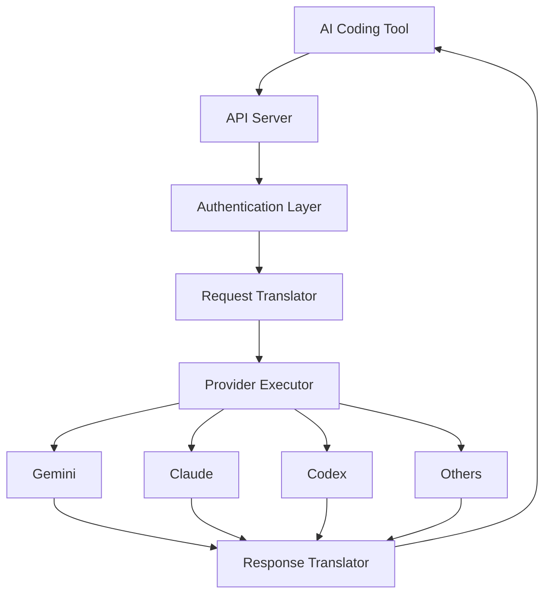

## What is CLI Proxy API?

CLI Proxy API is a proxy server that provides OpenAI/Gemini/Claude compatible API interfaces for AI coding assistants. It enables you to use local or multi-account CLI access with OpenAI, Gemini, Claude, and other AI coding tools through a unified API interface.

### Why CLI Proxy API?

- **Unified Interface**: Single OpenAI-compatible API for multiple AI providers
- **Multi-Account Management**: Use multiple accounts with automatic load balancing
- **OAuth Support**: Authenticate with your existing subscriptions (no API keys needed)
- **Smart Routing**: Automatic failover, quota management, and model aliasing
- **Hot Reload**: Update configuration and credentials without restarting

## Architecture

CLI Proxy API follows a layered architecture that translates requests between different AI provider formats:



## Request Flow

When a client makes a request, it flows through these components:

### 1. API Server

The API server (`internal/api/server.go`) handles incoming HTTP requests and provides multiple endpoint formats:

```go
// OpenAI-compatible endpoints
/v1/chat/completions
/v1/models

// Provider-specific endpoints
/api/provider/{provider}/v1/...

// Management endpoints
/v0/management/...
```

### 2. Authentication & Selection

The `auth.Manager` (`sdk/cliproxy/auth/conductor.go`) orchestrates credential selection:

<CodeGroup>
```go sdk/cliproxy/auth/conductor.go
// Manager orchestrates auth lifecycle, selection, execution, and persistence.
type Manager struct {
    store     Store
    executors map[string]ProviderExecutor
    selector  Selector
    hook      Hook
    auths     map[string]*Auth
    scheduler *authScheduler
    providerOffsets map[string]int
}
```

```go Selection Process
// Selector chooses an auth candidate for execution.
type Selector interface {
    Pick(ctx context.Context, provider, model string, 
         opts executor.Options, auths []*Auth) (*Auth, error)
}
```
</CodeGroup>

The manager:
- **Loads credentials** from the auth directory (`~/.cli-proxy-api` by default)
- **Selects the best credential** using the configured routing strategy
- **Handles cooldowns** for quota-exceeded accounts
- **Auto-refreshes tokens** in the background

### 3. Request Translation

Translators (`internal/translator/`) convert between API formats:

```
OpenAI Format → Translator → Provider Format
{
  "model": "gpt-4",              {
  "messages": [...],      →        "model": "gemini-2.5-pro",
  "temperature": 0.7               "contents": [...],
}                                  "generationConfig": {...}
                                 }
```

Each provider has dedicated translators:
- `translator/gemini/` - Gemini API format
- `translator/claude/` - Claude API format  
- `translator/codex/` - OpenAI Codex format
- `translator/antigravity/` - Antigravity format

### 4. Provider Execution

Executors (`sdk/cliproxy/executor/`) handle the actual API calls:

```go sdk/cliproxy/executor/types.go
// Request encapsulates the translated payload sent to a provider executor.
type Request struct {
    Model    string
    Payload  []byte
    Format   translator.Format
    Metadata map[string]any
}

// Response wraps either a full provider response or metadata.
type Response struct {
    Payload  []byte
    Metadata map[string]any
    Headers  http.Header
}
```

Executors:
- **Inject credentials** into the provider request
- **Execute HTTP calls** to the provider API
- **Handle streaming** with SSE or other formats
- **Report errors** for quota management

### 5. Response Translation

The response flows back through translators to convert provider responses to OpenAI format:

```
Provider Response → Translator → OpenAI Format
```

## Core Concepts

### Providers

A provider represents an AI service backend. Supported providers:

- **Gemini CLI** - Google's Gemini via OAuth
- **AI Studio** - Google AI Studio API keys
- **Vertex AI** - Google Cloud Vertex AI
- **Claude Code** - Anthropic Claude via OAuth
- **Codex** - OpenAI GPT models via OAuth
- **Qwen Code** - Alibaba Qwen models
- **iFlow** - Z.ai's GLM models
- **Antigravity** - Google's code assistance
- **Kimi** - Moonshot AI models
- **OpenAI Compatibility** - Any OpenAI-compatible endpoint

Each provider has its own:
- Authentication method (OAuth, API key, service account)
- Request/response format
- Model catalog
- Quota limits

### Executors

Executors implement the `ProviderExecutor` interface:

```go sdk/cliproxy/auth/conductor.go
type ProviderExecutor interface {
    // Identifier returns the provider key
    Identifier() string
    
    // Execute handles non-streaming execution
    Execute(ctx context.Context, auth *Auth, req Request, 
            opts Options) (Response, error)
    
    // ExecuteStream handles streaming execution
    ExecuteStream(ctx context.Context, auth *Auth, req Request, 
                  opts Options) (*StreamResult, error)
    
    // Refresh attempts to refresh provider credentials
    Refresh(ctx context.Context, auth *Auth) (*Auth, error)
    
    // CountTokens returns the token count for a request
    CountTokens(ctx context.Context, auth *Auth, req Request, 
                opts Options) (Response, error)
    
    // HttpRequest injects credentials and executes HTTP requests
    HttpRequest(ctx context.Context, auth *Auth, 
                req *http.Request) (*http.Response, error)
}
```

### Model Registry

The `ModelRegistry` (`internal/registry/model_registry.go`) manages available models:

```go internal/registry/model_registry.go
type ModelRegistry struct {
    // models maps model ID to registration information
    models map[string]*ModelRegistration
    // clientModels maps client ID to models it provides
    clientModels map[string][]string
    // clientProviders maps client ID to provider identifier
    clientProviders map[string]string
}
```

Features:
- **Dynamic model list** - Models appear/disappear based on available credentials
- **Quota tracking** - Hides models when all accounts hit quota
- **Multi-provider** - Same model can be served by multiple providers
- **Reference counting** - Tracks how many accounts can serve each model

### Auth State Management

The scheduler (`sdk/cliproxy/auth/scheduler.go`) maintains credential state:

```go sdk/cliproxy/auth/scheduler.go
type scheduledState int

const (
    scheduledStateReady      // Available for requests
    scheduledStateCooldown   // Quota exceeded, waiting
    scheduledStateBlocked    // Temporarily disabled
    scheduledStateDisabled   // Permanently disabled
)
```

When a request fails due to quota:
1. Credential enters **cooldown** state
2. Next request tries a different credential
3. After cooldown expires, credential returns to **ready** state

## Configuration Architecture

Configuration is loaded from `config.yaml`:

```yaml config.yaml
host: ""
port: 8317
auth-dir: "~/.cli-proxy-api"

# API keys for client authentication
api-keys:
  - "your-api-key-1"

# Routing strategy
routing:
  strategy: "round-robin"  # or "fill-first"

# Provider-specific configs
gemini-api-key:
  - api-key: "AIzaSy..."
    prefix: "personal"
    models:
      - name: "gemini-2.5-flash"
        alias: "gemini-flash"
```

See the [Configuration](/configuration/server) section for details.

## Hot Reload

CLI Proxy API watches for changes in:
- **Config file** - Automatically reloads on changes
- **Auth directory** - Picks up new credentials immediately
- **Token refresh** - Refreshes expired OAuth tokens in background

No restart required when:
- Adding new accounts
- Updating model mappings
- Changing routing strategy
- Modifying API keys

## Streaming Support

All providers support streaming responses via Server-Sent Events (SSE):

```typescript Client Example
const response = await fetch('http://localhost:8317/v1/chat/completions', {
  method: 'POST',
  headers: {
    'Content-Type': 'application/json',
    'Authorization': 'Bearer your-api-key'
  },
  body: JSON.stringify({
    model: 'gemini-2.5-pro',
    messages: [{role: 'user', content: 'Hello'}],
    stream: true
  })
});

const reader = response.body.getReader();
while (true) {
  const {done, value} = await reader.read();
  if (done) break;
  // Process SSE chunks
}
```

Streaming features:
- **Keep-alive**: Periodic blank lines prevent timeouts
- **Bootstrap retries**: Retry before first byte is sent
- **Graceful errors**: Errors sent as SSE events

## Next Steps

<CardGroup cols={2}>
  <Card title="Authentication" icon="key" href="/concepts/authentication">
    Learn about OAuth flows and multi-account management
  </Card>
  <Card title="Providers" icon="cloud" href="/concepts/providers">
    Explore supported providers and their features
  </Card>
  <Card title="Routing" icon="route" href="/concepts/routing">
    Understand request routing and load balancing
  </Card>
  <Card title="Configuration" icon="gear" href="/configuration/server">
    Configure your proxy server
  </Card>
</CardGroup>